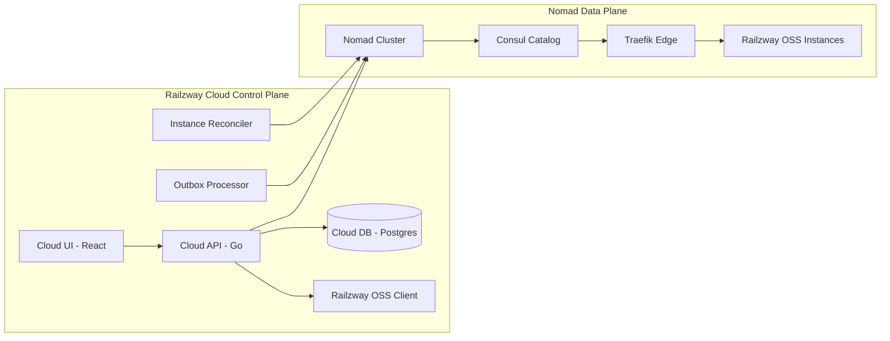

# Railzway Cloud Architecture and Deployment (Nomad, Consul, Traefik)

This document describes Railzway Cloud as a control plane and the deployment approach for the initial non-HA stage, plus the plan to scale to HA as demand grows.

## 1. Architecture Overview

Railzway Cloud is a control plane that:
- manages organizations, onboarding, and subscriptions,
- provisions a dedicated database per tenant,
- generates and registers Nomad jobs for Railzway OSS,
- routes tenant traffic via Consul + Traefik.

### 1.1 High-Level Diagram

### 1.2 Key Components

- Cloud API (Go + Gin + FX)
  - Router and handlers in `railzway-cloud/internal/api`.
  - Deployment orchestration in `railzway-cloud/internal/usecase/deployment`.
- Cloud UI (React)
  - Assets are served by the backend (see `STATIC_DIR`).
- Cloud DB (Postgres)
  - Stores organizations, instances, and outbox events.
- Outbox Processor
  - Executes side effects after DB writes (see `railzway-cloud/internal/outbox`).
- Instance Reconciler
  - Syncs instance status from Nomad (see `railzway-cloud/internal/reconciler`).
- Database Provisioner
  - Creates per-org database and user (see `railzway-cloud/internal/adapter/provisioning/postgres`).
- Nomad Job Generator
  - Builds job spec, environment, and Traefik tags (see `railzway-cloud/pkg/nomad`).
- Consul + Traefik
  - Consul acts as service catalog, Traefik routes by host tags.

## 2. Instance Provisioning Flow

1. User onboards through Cloud UI / API.
2. Cloud API saves org and instance, then writes an outbox event.
3. Outbox Processor:
   - ensures customer and subscription in Railzway OSS,
   - runs `DeployUseCase`.
4. DeployUseCase:
   - generates per-org DB credentials,
   - provisions the DB,
   - registers a Nomad job.
5. Nomad runs the Railzway OSS container and registers it in Consul.
6. Traefik routes traffic using `{org_slug}.{APP_ROOT_DOMAIN}`.
7. Instance Reconciler marks the instance active when allocation is running.

Detailed DB provisioning is in `railzway-cloud/docs/database-provisioning.md`.

## 3. Nomad Job Design

Tenant jobs are generated by `railzway-cloud/pkg/nomad/generator.go`:
- Job name: `railzway-org-{org_id}`
- Image: `ghcr.io/smallbiznis/railzway:{version}`
- Key env vars:
  - DB: `DB_HOST`, `DB_PORT`, `DB_NAME`, `DB_USER`, `DB_PASSWORD`, `DATABASE_URL`
  - OAuth: `OAUTH2_CLIENT_ID`, `OAUTH2_CLIENT_SECRET`, `AUTH_JWT_SECRET`
  - Rate limit: `RATE_LIMIT_REDIS_*`
- Traefik tags:
  - `traefik.enable=true`
  - `traefik.http.routers.org-{id}.rule=Host({org_slug}.{APP_ROOT_DOMAIN})`
- Placement constraints via node metadata:
  - `node.meta.tier` (free-trial, starter, pro, team, enterprise)
  - `node.meta.compute` (hetzner, digitalocean, gcp, aws)

Note: constraints are skipped when `APP_ENV=development` or version is `development`.

## 4. Stage 1 Deployment (Non-HA)

### 4.1 Target Topology

A single VM is sufficient initially:
- Nomad Server + Nomad Client (same host)
- Consul Server (same host)
- Traefik as a Nomad system job
- Postgres for Cloud DB and provisioning
- Redis for rate limit (required by tenant OSS)

### 4.2 Quick Steps

1. Prepare a VM with Docker, Nomad, Consul.
2. Configure Nomad node metadata:
   - `node.meta.tier` and `node.meta.compute`.
3. Run base jobs:
   - `smallbiznis-infra/nomad/jobs/base/postgres.nomad.hcl`
   - `smallbiznis-infra/nomad/jobs/base/redis.nomad.hcl`
   - `smallbiznis-infra/nomad/jobs/base/traefik.nomad.hcl`
4. Run Railzway Cloud:
   - as a systemd service or a separate Nomad job.
5. Point wildcard DNS `*.railzway.com` to the Traefik IP.

### 4.3 Minimum Environment

For Cloud API:
- `APP_ROOT_DOMAIN`, `APP_ROOT_SCHEME`
- `DB_HOST`, `DB_PORT`, `DB_NAME`, `DB_USER`, `DB_PASSWORD`
- `PROVISION_DB_HOST`, `PROVISION_DB_PORT`, `PROVISION_DB_NAME`, `PROVISION_DB_USER`, `PROVISION_DB_PASSWORD`
- `RAILZWAY_CLIENT_URL`, `RAILZWAY_API_KEY`
- `TENANT_OAUTH2_CLIENT_ID`, `TENANT_OAUTH2_CLIENT_SECRET`, `TENANT_AUTH_JWT_SECRET_KEY`
- `PROVISION_RATE_LIMIT_REDIS_ADDR`, `PROVISION_RATE_LIMIT_REDIS_PASSWORD`, `PROVISION_RATE_LIMIT_REDIS_DB`
- `NOMAD_ADDR`, `NOMAD_TOKEN` (when ACL is enabled)

## 5. Stage 2 Deployment (Scale to HA)

### 5.1 Target Topology

- Nomad Server: 3 nodes (quorum)
- Nomad Client: at least 2-3 nodes (horizontal scale)
- Consul Server: 3 nodes
- Traefik: 2+ instances behind a Load Balancer
- Cloud DB: managed Postgres or replicated cluster
- Redis: managed or sentinel

### 5.2 Key Changes

- Separate control plane and data plane (dedicated VMs/clusters).
- Use persistent volumes for stateful jobs (Postgres/Redis) or managed services.
- Enable ACL for Nomad and Consul.
- Point wildcard DNS to the Load Balancer (not directly to nodes).
- Keep node metadata for tier/compute so placement constraints continue to work.

## 6. Operational Checks

- Cloud API health: `GET /health`
- Nomad job status: `nomad job status`
- Consul catalog: `consul catalog services`
- Traefik routing: check router for `org-{id}`
- Tenant health: `curl https://{org_slug}.{APP_ROOT_DOMAIN}/health`

## 7. Code References

- `railzway-cloud/pkg/nomad/generator.go`
- `railzway-cloud/internal/usecase/deployment`
- `railzway-cloud/internal/outbox`
- `railzway-cloud/internal/reconciler`
- `railzway-cloud/docs/database-provisioning.md`
- `smallbiznis-infra/nomad/jobs/base/traefik.nomad.hcl`
