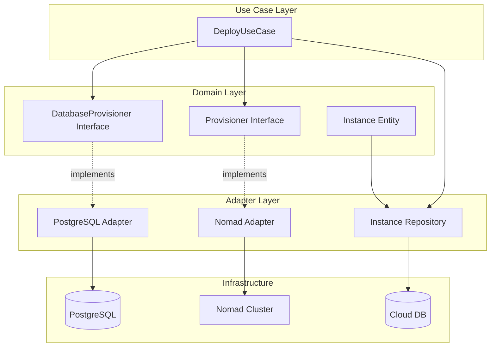
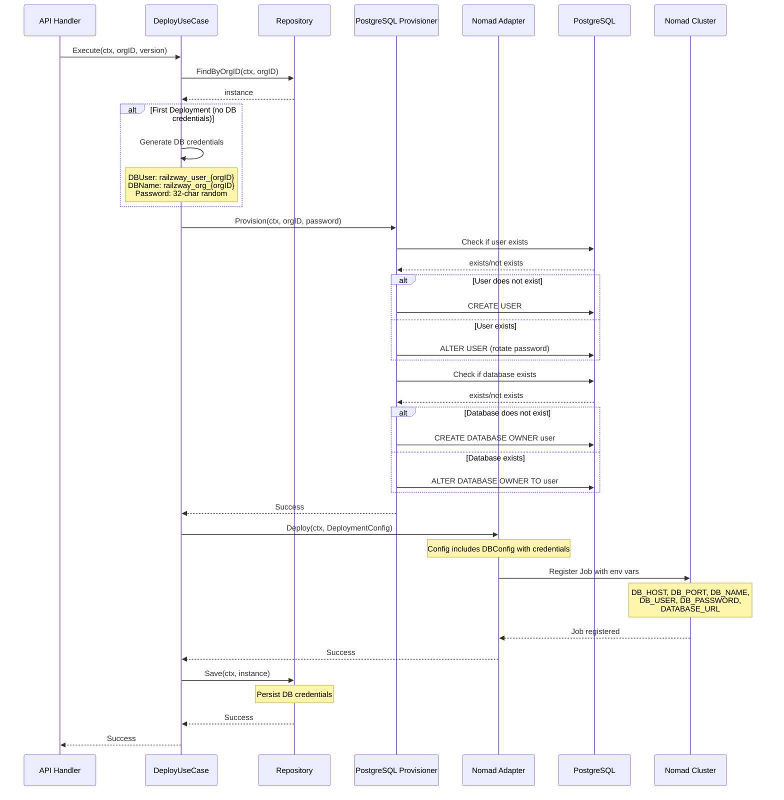
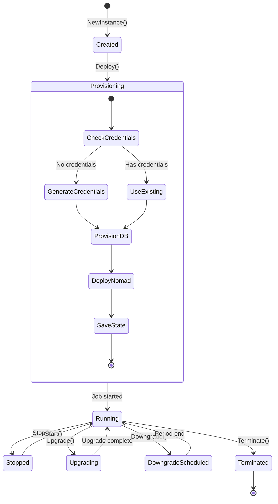
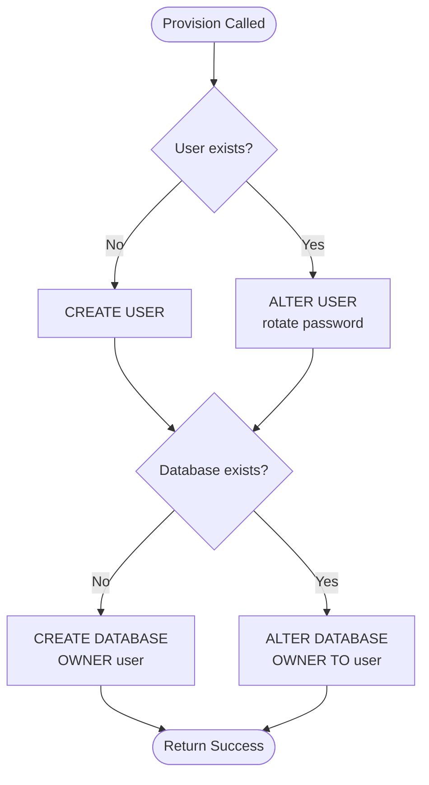
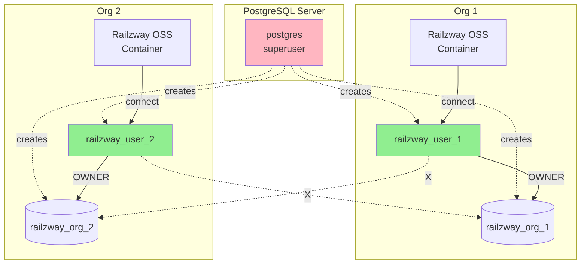
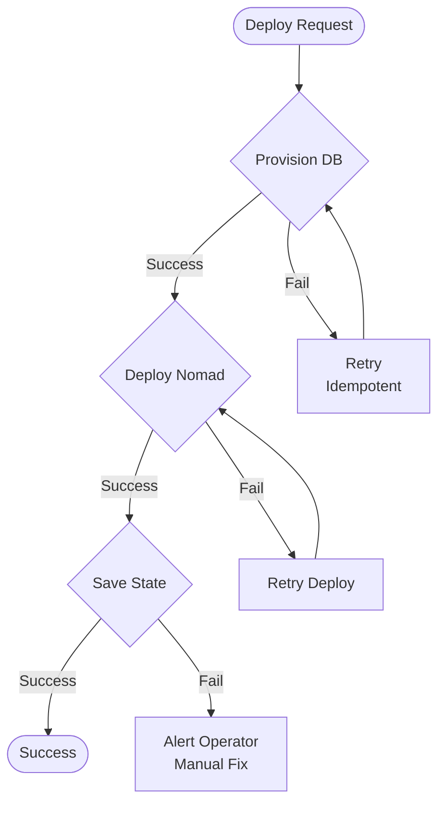

# Database Provisioning Documentation

## Overview

Railzway Cloud implements automated database provisioning to provide each organization with a dedicated PostgreSQL database and user. This ensures data isolation, security, and proper resource allocation per tenant.

## Architecture

### Component Diagram



### Layer Responsibilities

| Layer | Component | Responsibility |
|-------|-----------|----------------|
| **Domain** | `Instance` | Core entity with DB credentials |
| **Domain** | `DatabaseProvisioner` | Interface for DB provisioning |
| **Domain** | `Provisioner` | Interface for workload deployment |
| **Use Case** | `DeployUseCase` | Orchestrates provisioning flow |
| **Adapter** | `PostgreSQL Adapter` | Implements DB/user creation |
| **Adapter** | `Nomad Adapter` | Deploys jobs with credentials |
| **Adapter** | `Repository` | Persists instance state |

---

## Deployment Flow

### Sequence Diagram



---

## State Flow

### Instance Lifecycle with DB Provisioning



---

## Data Flow

### Credential Generation & Injection

```mermaid
flowchart LR
    subgraph "1. Generation"
        A[DeployUseCase] -->|crypto/rand| B[32-char password]
        A -->|format| C[railzway_user_{orgID}]
        A -->|format| D[railzway_org_{orgID}]
    end
    
    subgraph "2. Provisioning"
        B --> E[PostgreSQL Adapter]
        C --> E
        D --> E
        E -->|CREATE USER/DB| F[(PostgreSQL)]
    end
    
    subgraph "3. Persistence"
        B --> G[Instance Entity]
        C --> G
        D --> G
        G -->|Save| H[(Cloud DB)]
    end
    
    subgraph "4. Injection"
        G -->|DBConfig| I[Nomad Adapter]
        I -->|env vars| J[Nomad Job]
        J -->|runtime| K[Railzway OSS Container]
    end
```

---

## Idempotency

### Provisioning Logic



**Key Properties:**
- ✅ Safe to call multiple times
- ✅ Updates passwords on re-provision
- ✅ Ensures ownership is correct
- ✅ No-op if already provisioned correctly

---

## Security Model

### Isolation & Access Control



**Security Guarantees:**
- Each org has dedicated user and database
- Users have OWNER privileges on their database only
- No cross-tenant access
- Passwords stored encrypted in Cloud DB
- Credentials injected via Nomad (not in job spec)

---

## Error Handling

### Failure Scenarios

| Scenario | Behavior | Recovery |
|----------|----------|----------|
| **PostgreSQL unreachable** | Provision fails, deployment aborted | Retry deployment |
| **User creation fails** | Provision fails, no DB created | Fix PG issue, retry |
| **DB creation fails** | Provision fails, user may exist | Idempotent retry |
| **Nomad deployment fails** | DB provisioned, Nomad job not created | Retry deployment (DB already exists) |
| **Credentials save fails** | DB + Nomad provisioned, state not persisted | Manual reconciliation needed |

### Retry Flow



---

## Configuration

### Environment Variables

**Cloud Application:**
```bash
# PostgreSQL Admin Connection (for provisioning)
DB_HOST=localhost
DB_PORT=5432
DB_USER=postgres
DB_PASSWORD=<admin-password>
DB_NAME=postgres

# Nomad
NOMAD_ADDR=http://nomad.example.com:4646
NOMAD_TOKEN=<token>
```

**Injected into Railzway OSS Containers:**
```bash
# Generated per organization
DB_HOST=<tenant-db-host>
DB_PORT=5432
DB_NAME=railzway_org_<orgID>
DB_USER=railzway_user_<orgID>
DB_PASSWORD=<generated-password>
DATABASE_URL=postgres://railzway_user_<orgID>:<password>@<host>:5432/railzway_org_<orgID>?sslmode=disable
```

---

## Database Schema

### Migration: `000004_add_db_credentials.up.sql`

```sql
ALTER TABLE instances ADD COLUMN db_host VARCHAR(255);
ALTER TABLE instances ADD COLUMN db_port INT;
ALTER TABLE instances ADD COLUMN db_name VARCHAR(255);
ALTER TABLE instances ADD COLUMN db_user VARCHAR(255);
ALTER TABLE instances ADD COLUMN db_password VARCHAR(255);
```

### Instance Table Structure

| Column | Type | Description |
|--------|------|-------------|
| `id` | BIGSERIAL | Primary key |
| `org_id` | BIGINT | Organization ID (unique) |
| `nomad_job_id` | VARCHAR(255) | Nomad job identifier |
| `desired_version` | VARCHAR(50) | Target Railzway version |
| `current_version` | VARCHAR(50) | Running version |
| `status` | VARCHAR(50) | Instance status |
| `tier` | VARCHAR(50) | Pricing tier |
| `compute_engine` | VARCHAR(50) | Infrastructure provider |
| `subscription_id` | VARCHAR(255) | Billing subscription |
| **`db_host`** | **VARCHAR(255)** | **Database host** |
| **`db_port`** | **INT** | **Database port** |
| **`db_name`** | **VARCHAR(255)** | **Database name** |
| **`db_user`** | **VARCHAR(255)** | **Database user** |
| **`db_password`** | **VARCHAR(255)** | **Database password (encrypted)** |
| `created_at` | TIMESTAMP | Creation time |
| `updated_at` | TIMESTAMP | Last update time |

---

## Code References

### Key Files

| File | Purpose |
|------|---------|
| [internal/domain/instance/entity.go](file:///Users/taufiktriantono/go/src/github.com/smallbiznis/railzway-cloud/internal/domain/instance/entity.go) | Instance entity with DB fields |
| [internal/domain/provisioning/interface.go](file:///Users/taufiktriantono/go/src/github.com/smallbiznis/railzway-cloud/internal/domain/provisioning/interface.go) | Provisioning interfaces |
| [internal/adapter/provisioning/postgres/adapter.go](file:///Users/taufiktriantono/go/src/github.com/smallbiznis/railzway-cloud/internal/adapter/provisioning/postgres/adapter.go) | PostgreSQL provisioner |
| [internal/usecase/deployment/deploy.go](file:///Users/taufiktriantono/go/src/github.com/smallbiznis/railzway-cloud/internal/usecase/deployment/deploy.go) | Deploy orchestration |
| [pkg/nomad/generator.go](file:///Users/taufiktriantono/go/src/github.com/smallbiznis/railzway-cloud/pkg/nomad/generator.go) | Nomad job generation |

### Interface Definitions

**DatabaseProvisioner:**
```go
type DatabaseProvisioner interface {
    // Provision creates the database and user for the given organization.
    // It must be idempotent.
    Provision(ctx context.Context, orgID int64, password string) error
}
```

**Provisioner:**
```go
type Provisioner interface {
    Deploy(ctx context.Context, config DeploymentConfig) error
    Stop(ctx context.Context, orgID int64) error
    GetStatus(ctx context.Context, orgID int64) (string, error)
}
```

---

## Testing

### Manual Verification Steps

1. **Start PostgreSQL:**
   ```bash
   docker run -d -p 5432:5432 \
     -e POSTGRES_PASSWORD=password \
     postgres:15
   ```

2. **Start Nomad:**
   ```bash
   nomad agent -dev
   ```

3. **Deploy Instance:**
   ```bash
   # Via API or test script
   go run cmd/test-lifecycle/main.go
   ```

4. **Verify Database:**
   ```sql
   \c postgres
   \du                          -- List users
   \l                           -- List databases
   \c railzway_org_12345        -- Connect to org DB
   \dt                          -- List tables (after OSS migration)
   ```

5. **Verify Nomad Job:**
   ```bash
   nomad job status railzway-org-12345
   nomad alloc logs <alloc-id> | grep DATABASE_URL
   ```

### Expected Results

- ✅ User `railzway_user_<orgID>` created
- ✅ Database `railzway_org_<orgID>` created with correct owner
- ✅ Nomad job running with DB env vars
- ✅ Credentials persisted in Cloud DB

---

## Future Enhancements

1. **Password Encryption at Rest**
   - Encrypt `db_password` column using AES-256
   - Store encryption key in secure vault (HashiCorp Vault, AWS KMS)

2. **Connection Pooling**
   - Implement PgBouncer for tenant databases
   - Reduce connection overhead

3. **Database Metrics**
   - Monitor per-tenant DB size
   - Track connection counts
   - Alert on quota violations

4. **Automated Backups**
   - Schedule per-tenant backups
   - Implement point-in-time recovery

5. **Multi-Region Support**
   - Provision databases in user's preferred region
   - Implement read replicas for global deployments
