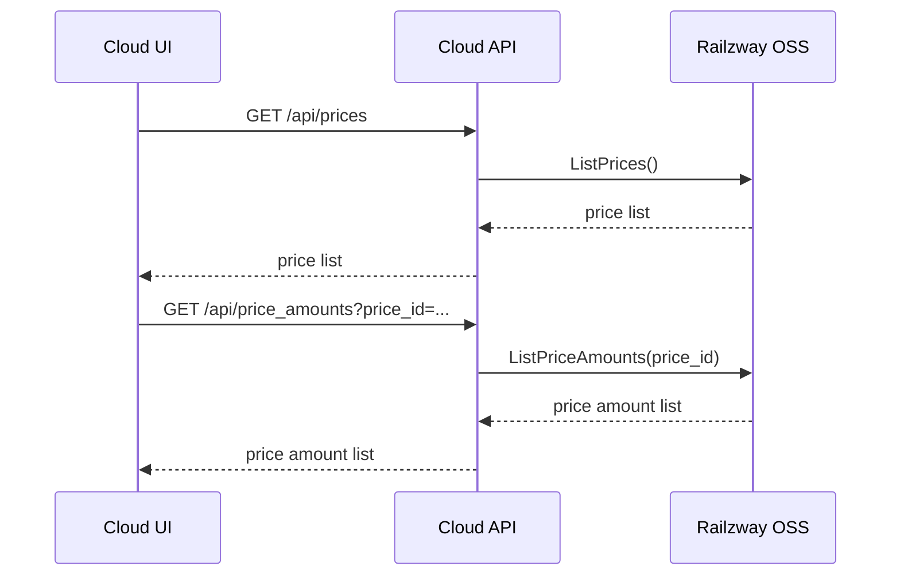
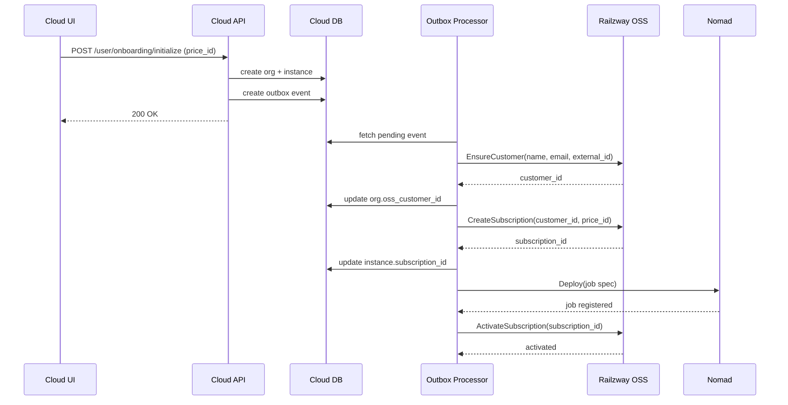
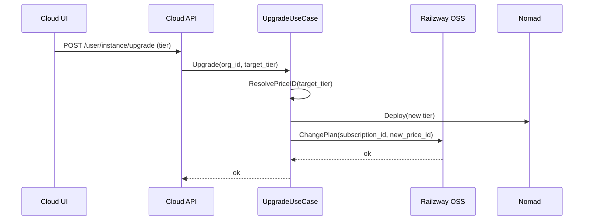
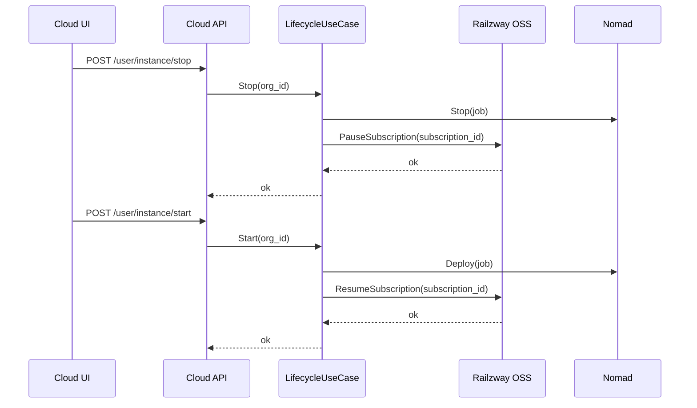

# Railzway Cloud to Railzway OSS Integration Sequences

This document explains the main flows for how Railzway Cloud uses Railzway OSS for pricing and billing. All OSS calls are made through `railzway-cloud/pkg/railzwayclient` configured via `RAILZWAY_CLIENT_URL` and `RAILZWAY_API_KEY`.

## 1. Pricing for Onboarding

Cloud UI calls the Cloud API endpoints, and the Cloud API proxies to the OSS pricing API.

Code references:
- `railzway-cloud/internal/api/pricing.go`
- `railzway-cloud/pkg/railzwayclient/pricing.go`

## 2. Onboarding and Provisioning (Customer + Subscription + Activation)

Onboarding creates org and instance records in the Cloud DB, then side effects (OSS and Nomad) are executed by the Outbox Processor to keep DB state authoritative.

Code references:
- `railzway-cloud/internal/onboarding/service.go`
- `railzway-cloud/internal/outbox/processor.go`
- `railzway-cloud/pkg/railzwayclient/subscription.go`

## 3. Upgrade / Downgrade Plan

Upgrade and downgrade go through OSS for subscription changes, while infrastructure changes are done via Nomad.

Code references:
- `railzway-cloud/internal/usecase/deployment/upgrade.go`
- `railzway-cloud/internal/adapter/billing/railzway_oss/adapter.go`

## 4. Pause / Resume Billing on Stop/Start

Stopping an instance pauses the OSS subscription; starting resumes it.

Code references:
- `railzway-cloud/internal/usecase/deployment/lifecycle.go`
- `railzway-cloud/internal/adapter/billing/railzway_oss/adapter.go`
